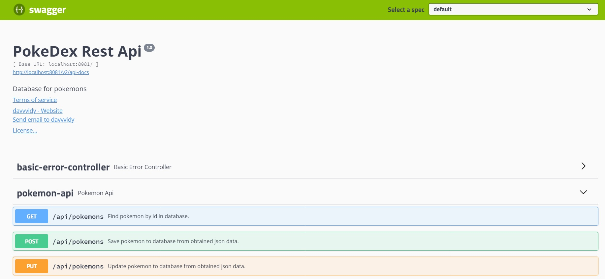
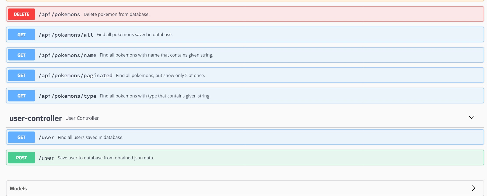

# PokeDex-RestApi
Simple rest api to manage pokemons.
## Table of contents
* [General info](#general-info)
* [Technologies](#technologies)
* [Features](#features)
* [Setup](#setup)
* [Project status](#project-status)
* [Photo](#photo)
## General Info
- Rest Api to manage pokemons in database.
- The reason for creating this program was to practice new technologies.
## Technologies
Project is created with:
- Java 11
- Spring Boot 2.5.1
- MySQL 8.0.22
- Swagger2 / Swagger ui 2.9.2
- Spring Security
## Features
- Pokemon CRUD (get/post/read/put)
- Pagination
- Login as User or Admin
- Authentications
- Database initializer
- Guest (no-login) priviliges: most of the gets
- User privileges: adding new pokemon
- Admin privleges: editing and deleting pokemons
- Documentation made in Swagger
## Setup
- Clone this repo to your desktop and reload maven to build dependencies.
- Set correct application properties.
- Run your application in Web browser
## Project status
TODO: tests + error handling
## Photo 
  
  
